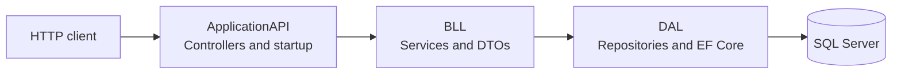

# Portal Management API

A layered ASP.NET Core Web API for managing departments and employees. The project separates HTTP endpoints, business services, and SQL Server data access into three .NET projects.

## What it does

- Exposes REST-style endpoints for departments and employees.
- Provides department lookup, including a department-with-employees query and search by department name.
- Uses DTOs to shape API data and AutoMapper to map between DTOs and Entity Framework entities.
- Persists `Department` and `Employee` entities with Entity Framework Core and SQL Server.

This repository contains the backend API; no frontend application is included.

## Architecture



### Projects

| Project | Responsibility |
| --- | --- |
| `ApplicationAPI` | ASP.NET Core entry point, dependency registration, OpenAPI in Development, and API controllers. |
| `BLL` | Department and employee services, DTOs, and AutoMapper configuration. |
| `DAL` | Entity Framework Core context and models, repositories, and database migrations. |

### Request flow

Controllers receive HTTP requests and call the matching service in `BLL`. Services coordinate repository operations, map entity data to or from DTOs, and return results. Repositories use `EMSContext` to query or update SQL Server. `EMSContext` exposes `Departments` and `Employees` sets.

## API routes

Routes use the `api/[controller]` prefix. For example, department routes begin with `/api/Department`.

### Departments

| Method | Route | Purpose |
| --- | --- | --- |
| `GET` | `/api/Department/all` | List departments. |
| `GET` | `/api/Department/{id}` | Get a department by ID. |
| `POST` | `/api/Department/Create` | Create a department. |
| `POST` | `/api/Department/Update` | Update a department. |
| `DELETE` | `/api/Department/delete/{id}` | Delete a department. |
| `GET` | `/api/Department/all/employees` | List departments with their employees. |
| `GET` | `/api/Department/find/{name}` | Find a department by name. |

### Employees

| Method | Route | Purpose |
| --- | --- | --- |
| `GET` | `/api/Employee/all` | List employees. |
| `GET` | `/api/Employee/{id}` | Get an employee by ID. |
| `POST` | `/api/Employee/create` | Create an employee. |
| `POST` | `/api/Employee/update` | Update an employee. |
| `POST` | `/api/Employee/delete/{id}` | Delete an employee. |

Create and update actions accept the corresponding DTO as the request body. Check `DepartmentDTO` and `EmployeeDTO` for the current payload fields.

## Technology

- .NET target framework: `net10.0`
- ASP.NET Core Web API and OpenAPI support
- Entity Framework Core `9.0.11`
- SQL Server provider for Entity Framework Core
- AutoMapper for entity/DTO mapping

## Run locally

### Prerequisites

- .NET 10 SDK
- A reachable SQL Server instance (LocalDB, SQL Server Express, or another SQL Server)

### 1. Clone and restore

```bash
git clone https://github.com/TirthaBarua/PortalManagement.git
cd PortalManagement
dotnet restore PortalManagement.slnx
```

### 2. Configure the database connection

The API reads the connection string named `DbConn`. Configure it outside source control. For example, with PowerShell:

```powershell
$env:ConnectionStrings__DbConn = "Server=(localdb)\MSSQLLocalDB;Database=PortalManagementDb;Trusted_Connection=True;TrustServerCertificate=True"
```

Replace the server and authentication details with values for your SQL Server environment. Keep credentials out of committed settings files.
